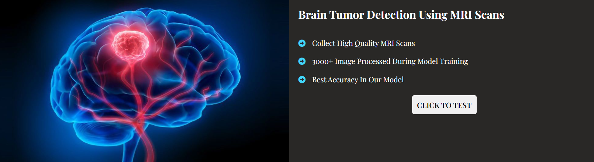
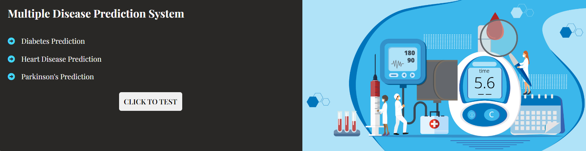

# Super Speciality Hospital


Super Speciality Hospital Is A Modern Healthcare Website That Utilizes Artificial Intelligence For Disease Detection And Prediction. The Website Is Built With HTML, CSS, And JavaScript, Providing A User-Friendly Interface To Interact With Two Python Models : Brain Tumor Detection Using MRI Scans And Multiple Disease Prediction System Which Includes - Diabetes , Heart And Parkinson's Disease.

## Features

- **AI - Powered Disease Detection :** Utilizes advanced Python models to detect brain tumors and predict multiple diseases such as diabetes, heart diseases, and Parkinson's.

- **Responsive Design :** The website is designed to provide an optimal viewing experience across various devices.

## Models

### 1. Brain Tumor Detection Using MRI Scans

- Click to test the Brain Tumor Detection model.
- Model trained on 3000+ high-quality MRI scans for accurate results.

### 2. Multiple Disease Prediction System

- Click to test the Multiple Disease Prediction model.
- Predicts diabetes onset, forecasts heart disease risk, and identifies Parkinson's disease symptoms.

## Usage

1. Clone the repository :
   ```bash
   git clone https://github.com/ArpitAggarwal10/Super_Speciality_Hospital.git
   ```
2. Open `index.html` file and click on Go Live button.
3. Open any browser on your system and go to `http://127.0.0.1:5500/index.html`.

Now you landed on Super Speciality Hospital Website and check our developed models according to your medical needs.